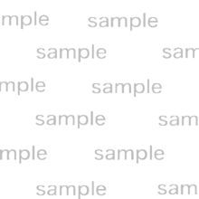
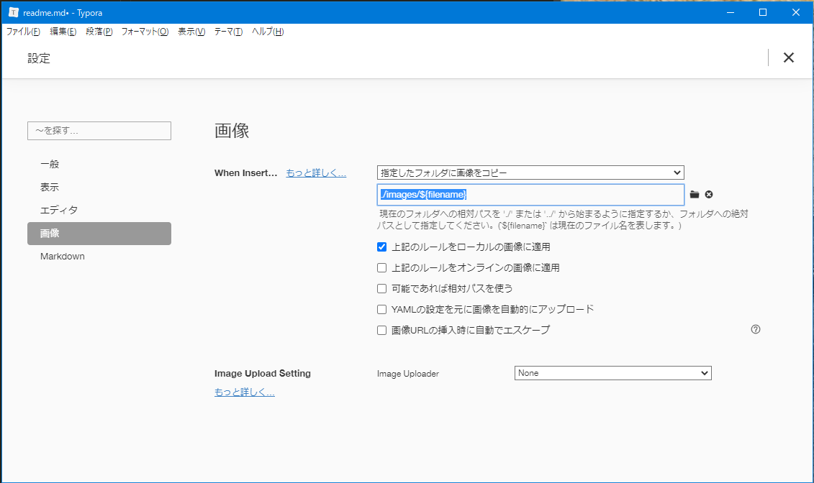

# SampleProject Information






1. てすと項目
   1. 小
      1. 少々


**文字装飾**

**<font color="pink">文字装飾</font>**

---  

# 見出し１
## 見出し２
### 見出し３
#### 見出し４
##### 見出し５

---

`#FF0000` [^1] [^2]
[^1]: 脚注は、どこに差し込んでも、文書の一番下に追加される。
[^2]: 脚注２を入れてみる。

`#00FF00`

```
const d = new Date();
```
